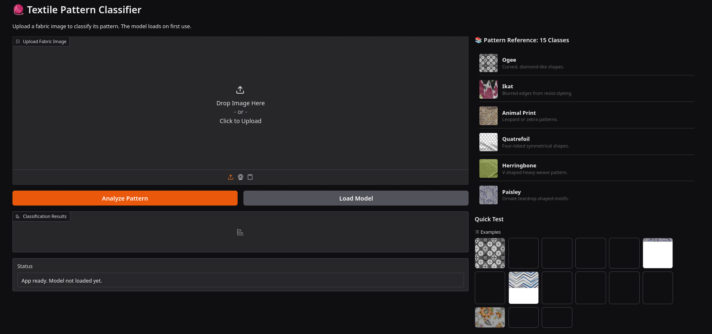
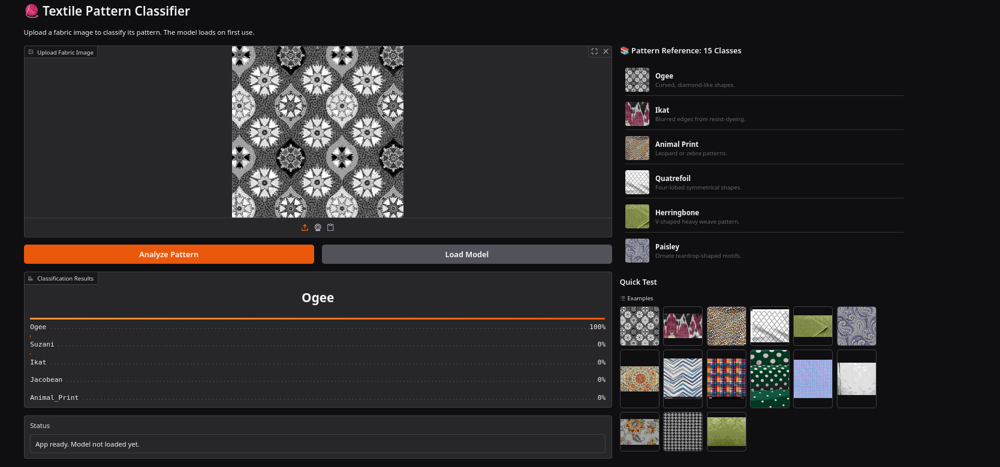

# Fabric Pattern Recognition System

An image classification project that identifies 15 fabric and textile pattern categories from images using deep learning.

This project was developed to classify textile patterns through their visual structure, repeated motifs, and distinctive design characteristics.

---

## Overview

The Textile Pattern Classifier is a computer vision project that recognises 15 different textile pattern classes from images.

The project combines automated dataset collection, image preprocessing, supervised model training, benchmarking across multiple ResNet architectures, and export of the best-performing trained model for deployment.

It is intended as a practical pattern-recognition system for textile education, design support, fabric catalogue organisation, and visual pattern identification.

---

## Application Demo
[link](https://huggingface.co/spaces/fahamidur2000/AI-Fabric-Classifier)<br>

The interface allows users to upload a fabric image, load the trained model, and receive an instant pattern classification result. The first screenshot shows the initial application layout, while the second presents a completed prediction example where the uploaded textile image is identified successfully.

### Initial Interface


### Prediction Example


---

## Recognised Pattern Classes

The model is designed to classify the following 15 textile pattern categories.

| Class | Description |
|---|---|
| Damask | Ornamental woven pattern with reversible motifs, often floral or formal in appearance. |
| Matelassé | Quilted or puckered fabric effect with raised texture and decorative surface patterning. |
| Quatrefoil | Repeating four-lobed motif often used in decorative textile design. |
| Houndstooth | Broken check pattern with jagged abstract shapes, commonly in black and white. |
| Suzani | Rich embroidered-style ornamental pattern associated with large floral and medallion motifs. |
| Chevron | Repeated zigzag pattern formed by inverted V-shaped lines. |
| Paisley | Curved teardrop-shaped motif with decorative internal detailing. |
| Ogee | Pattern built from curved diamond-like or onion-shaped repeated forms. |
| Jacobean | Floral pattern style with elaborate decorative leaves, vines, and botanical forms. |
| Ikat | Pattern effect created through blurred, feathered, or resist-dyed geometric and organic forms. |
| Animal Print | Pattern inspired by animal skins such as leopard, zebra, or tiger markings. |
| Dot / Polka Dot | Repeated circular dot motif arranged across a fabric surface. |
| Herringbone | V-shaped broken twill arrangement with directional geometric structure. |
| Plaid / Checkered | Repeated intersecting lines forming squares or blocks. |
| Gingham | Balanced checked pattern usually formed by dyed yarn intersections. |

---

## Data Collection

The dataset is collected automatically using a custom Python scraper built for textile pattern image gathering.

The scraper uses DuckDuckGo image search as the main source and Wikimedia Commons as a fallback source when search results are weak or unavailable.

It is configured to gather images for all 15 classes, with a target of 300 images per class.

The scraping pipeline includes duplicate checking through SHA-256 hashing, URL tracking, retry logic, result filtering, size validation, and standardised image saving.

The script also applies class-specific negative hints to reduce irrelevant results such as logos, vectors, mock-ups, wildlife photographs, icons, and screenshots.

Images are stored in organised class folders under a raw image dataset directory, and the script can optionally perform global deduplication and create a ZIP archive of the dataset.

---

## Technical Implementation

### 1. Dataset Preparation

The training notebook uses Fastai’s `DataBlock` API to build the dataset pipeline.

Images are loaded from folder-based class labels, split into training and validation sets using a random split with `valid_pct=0.2` and `seed=42`, and resized to `224 x 224`.

Data augmentation is applied through horizontal flipping, controlled rotation, zoom, lighting adjustment, and warp transforms.

The notebook also calculates class counts from the training split and derives inverse-frequency class weights, showing awareness of potential class imbalance during training.

### 2. Model Benchmarking

The project benchmarks three convolutional neural network backbones based on the ResNet family.

The candidate architectures are `resnet18`, `resnet34`, and `resnet50`.

Each model is trained using Fastai’s `vision_learner`, with `accuracy` and `error_rate` used as evaluation metrics.

During the first training stage, each candidate model is fine-tuned for 5 epochs and monitored with `SaveModelCallback` so that the best checkpoint can be preserved.

### 3. Model Selection and Interpretation

After validation, the notebook selects the best-performing model by comparing validation accuracy across the benchmarked architectures.

A `ClassificationInterpretation` object is then used to generate a confusion matrix for the selected model, allowing class-level inspection of prediction performance.

### 4. Final Fine-Tuning and Export

Once the best architecture is selected, the model is reloaded, unfrozen, and trained further using `fit_one_cycle` for 10 additional epochs.

The final trained model is exported as `textile_pattern_best.pkl`, making it ready for inference or later deployment.

---

## Model Workflow

The complete workflow of the project follows a clear sequence from raw data collection to trained model export.

1. Collect textile pattern images using the scraper  
2. Organise images into class-based folders  
3. Build training and validation datasets with Fastai  
4. Apply image resizing and augmentation  
5. Train and compare multiple ResNet models  
6. Select the strongest model based on validation accuracy  
7. Inspect performance using a confusion matrix  
8. Fine-tune the best model further and export it  


---

## Installation

### Clone the Repository

```bash
git clone https://github.com/your-username/textile-pattern-classifier.git
cd textile-pattern-classifier
```

### Install Dependencies

```bash
pip install -r requirements.txt
```

---

## Dataset Scraping

To collect raw images for the 15 pattern classes, run the scraper script.

```bash
python scrapper.py
```

The scraper will create the required project directories, generate raw image folders for each class, store logs, and attempt to build a balanced image set with duplicate protection and validation checks.

---

## Model Training

Training is performed in the notebook using Fastai.

The notebook builds the image pipeline, benchmarks several ResNet backbones, selects the best model, and exports the final trained classifier.

A typical training workflow follows this sequence.

```python
# Build dataloaders
# Train resnet18, resnet34, resnet50
# Compare validation accuracy
# Plot confusion matrix
# Fine-tune best model
# Export textile_pattern_best.pkl
```

---

## Project Structure

```bash
textile-pattern-classifier/
│
├── app.py
├── examples/
│   ├── Animal_Print.jpg
│   ├── Chevron.jpg
│   ├── Damask.jpg
│   ├── Dot_Polka_Dot.jpg
│   ├── Gingham.jpg
│   ├── Herringbone.jpg
│   ├── Houndstooth.jpg
│   ├── Ikat.jpg
│   ├── Jacobean.jpg
│   ├── Matelasse.jpg
│   ├── Ogee.jpg
│   ├── Paisley.jpg
│   ├── Plaid_Checkered.jpg
│   ├── Quatrefoil.jpg
│   └── Suzani.jpg
├── model.pkl
├── Notebooks/
│   ├── scrapper.py
│   └── training.ipynb
├── README.md
└── requirements.txt

```

---

## Potential Applications

This project has several practical and academic uses because it focuses on recognising visually similar but structurally distinct fabric categories.

Possible applications include textile education, interior and fashion design support, digital cataloguing of patterned fabrics, and experimental computer vision research on fine-grained visual classification.

---

## Contact

Email: [fahamidur2000@gmail.com](mailto:fahamidur2000@gmail.com) <br>
LinkedIn: [https://www.linkedin.com/in/fahamidur/](https://www.linkedin.com/in/fahamidur/)
